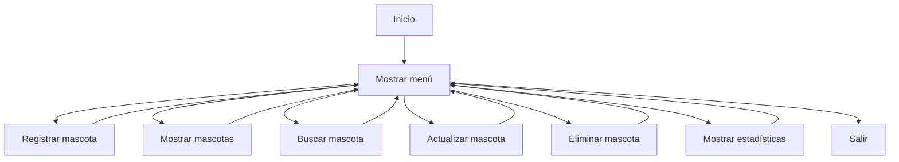

# 🐾 Sistema de Gestión de Mascotas

> Proyecto desarrollado como parte de una simulación de una empresa de desarrollo de software, con el objetivo de fortalecer la lógica de programación y el desarrollo de aplicaciones de consola utilizando Python.

---

# 📖 Descripción

El **Sistema de Gestión de Mascotas** es una aplicación de consola que permite administrar el registro de mascotas de una clínica veterinaria.

El sistema implementa operaciones CRUD (Crear, Leer, Actualizar y Eliminar), validación de datos, generación automática de códigos únicos y estadísticas generales sobre las mascotas registradas.

Este proyecto fue desarrollado para reforzar el uso de funciones, listas, diccionarios, validaciones y recorridos de datos en Python.

---

# 🎯 Objetivos del proyecto

- Practicar programación estructurada.
- Implementar un CRUD completo.
- Organizar el código mediante funciones.
- Trabajar con listas y diccionarios.
- Aplicar validaciones de entrada.
- Generar identificadores únicos.
- Calcular estadísticas utilizando recorridos sobre listas.
- Mejorar la lógica de programación.

---

# ✨ Funcionalidades

El sistema permite:

- ✅ Registrar mascotas
- ✅ Mostrar todas las mascotas registradas
- ✅ Buscar mascotas por código
- ✅ Actualizar información de una mascota
- ✅ Eliminar mascotas
- ✅ Mostrar estadísticas generales
- ✅ Validar los datos ingresados por el usuario
- ✅ Generar códigos automáticos para cada mascota

---

# 🛠 Tecnologías utilizadas

| Tecnología | Uso |
|------------|-----|
| Python 3 | Lenguaje principal |
| List | Almacenamiento de mascotas |
| Dictionary | Representación de cada mascota |

---

# 📂 Estructura del proyecto

```text
Sistema-Gestion-Mascotas/

│
├── main.py
└── README.md
```

---

# 📚 Información registrada

Cada mascota almacena la siguiente información:

| Campo | Descripción |
|---------|-------------|
| Código | Identificador único (MAS-001) |
| Nombre | Nombre de la mascota |
| Especie | Tipo de animal |
| Raza | Raza de la mascota |
| Edad | Edad en años |
| Peso | Peso en kilogramos |
| Propietario | Nombre del propietario |
| Vacunado | Estado de vacunación |

---

# ⚙️ Menú principal

```text
1. Registrar mascota
2. Mostrar mascotas
3. Buscar por código
4. Actualizar mascota
5. Eliminar mascota
6. Estadísticas
7. Salir
```

---

# 🚀 Instalación

Clonar el repositorio

```bash
git clone https://github.com/usuario/repositorio.git
```

Entrar al proyecto

```bash
cd Sistema-Gestion-Mascotas
```

Ejecutar

```bash
python main.py
```

---

# 📊 Estadísticas disponibles

El sistema calcula automáticamente:

- Total de mascotas registradas.
- Promedio de edad.
- Promedio de peso.
- Mascota más joven.
- Mascota de mayor edad.
- Cantidad de perros.
- Cantidad de gatos.
- Cantidad de mascotas de otras especies.

---

# 💼 Competencias desarrolladas

Durante el desarrollo del proyecto se trabajó en:

- Diseño de aplicaciones de consola.
- Programación estructurada.
- Organización del código mediante funciones.
- Modelado de datos utilizando listas y diccionarios.
- Validación de datos ingresados por el usuario.
- Generación automática de identificadores.
- Búsqueda secuencial.
- Actualización y eliminación de registros.
- Cálculo de estadísticas mediante recorridos.
- Desarrollo de operaciones CRUD.

---

# 🧠 Conceptos de Python aplicados

Este proyecto utiliza:

- Variables
- Funciones
- Parámetros
- Retorno de valores
- Listas
- Diccionarios
- Condicionales
- Bucles `while`
- Bucles `for`
- `match-case`
- Manejo de excepciones (`try / except`)
- Validaciones
- CRUD
- Formateo de cadenas (`f-string`)

---

# 🏗 Flujo del sistema



---

# 📈 Mejoras futuras

Algunas funcionalidades que podrían incorporarse en futuras versiones:

- Persistencia de datos mediante JSON.
- Historial clínico de las mascotas.
- Registro de vacunas.
- Registro de consultas veterinarias.
- Registro de tratamientos.
- Búsqueda por nombre.
- Búsqueda por propietario.
- Filtros por especie.
- Reportes avanzados.
- Interfaz gráfica.
- Arquitectura modular.

---

# 📌 Estado del proyecto

🟢 **Finalizado (Versión de aprendizaje)**

El proyecto cumple los objetivos planteados para practicar programación estructurada, desarrollo de sistemas CRUD y procesamiento de información utilizando Python.

---

# 👨‍💻 Autor

Desarrollado por **Ridelfis Enmanuel Franco** como parte de su proceso de aprendizaje y de una simulación de una empresa de desarrollo de software, enfocada en la creación de proyectos reales para fortalecer habilidades en desarrollo de software.

---